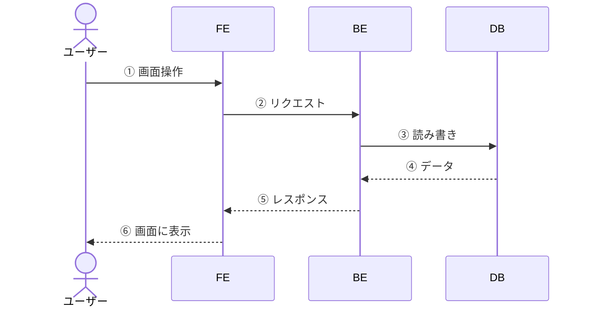

# Webアプリの基本構成

この章では、これから触れていくアプリ全体を理解するための基本形を紹介します。 
個々の技術の前に、まず「Webアプリとはどのように動いているのか」の概観を理解しましょう。

## Webアプリは「3つの層」でできている

ふだん私たちが使うWebアプリ（SNS、ショッピングサイト、社内ツール…）は、
役割の異なる **3つの層** が協力して動いています。

| 層                     | 役割                                 | たとえると             |
| ---------------------- | ------------------------------------ | ---------------------- |
| **フロントエンド(FE)** | 画面の表示と操作。ブラウザの中で動く | お店の接客カウンター   |
| **バックエンド(BE)**   | ロジックや判断、データの出し入れ     | 奥で働く調理場         |
| **データベース(DB)**   | データを保管しておく場所             | 食材や帳簿をしまう倉庫 |

- **FE** は、あなたがブラウザで見ている画面そのものです。ボタンや入力欄を表示し、クリックや入力を受け取ります。ユーザーの画面操作をBEに送信します（リクエスト）。
- **BE** は、「この登録は許可してよいか」「IDをどう発行するか」といった判断やデータ処理を担当します。
- **DB** は、データを安全にためておく倉庫です。ユーザー情報などを保存し、必要なときに取り出します。

## 1回の操作で、層をまたいで何が起きるか

たとえば、ユーザーが画面で **「登録」ボタンを押した** とき、こんな順番で処理が流れます。

1. **FE**：ボタンが押されたのを受け取り、BEに「登録して」とリクエストする
2. **BE**：リクエストを受けて、処理をする（たとえば新しいIDを発行する）
3. **DB**：BEの指示で、データを保存する
4. **BE → FE**：レスポンス（成功したか、発行されたIDは何か）を画面に返す
5. **FE**：受け取ったレスポンスを画面に表示する

## このサンプルで学ぶこと

このサンプルでは、上の3層を **「ユーザーIDを発行する」** という身近な題材で、実際に手を動かしながら学びます。

- BEが **どうやってユニークなIDを作るのか** を、自分で実装します
- FEからID発行を試し、DBに貯まっていく様子を見ます

次の章では、この3層が **具体的にどの技術で作られているか** を見て、実際に環境を立ち上げます。
