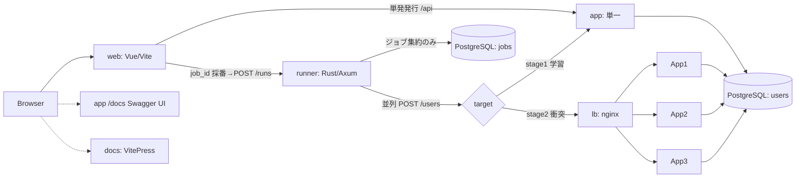

# サンプルUX強化フェーズ — 設計（フロントエンド / チュートリアル / OpenAPI / 負荷ランナー）

> 作成日: 2026-06-28
> 位置づけ: バックエンド実装完了後の **第2フェーズ＝サンプルとしての精度・UX を高める**ための設計。
> 上位ドキュメント `2026-06-28-user-id-issuance-teaching-design.md`（目的の言語化）と、完了済みの実装（`app/` 一式・衝突デモ）を土台に、学習者が**触って・見て・読んで**理解できるサンプルパッケージを完成させる。

---

## 1. 目的とスコープ

完成済みのバックエンド（ユーザーID発行API・2ステージ・並列衝突デモ）に対し、**学習体験（UX）**を付け足す。柱:

1. **解説ドキュメント**（VitePress チュートリアル）— 2段階を、さらに細かいステップに分けた導入。自習でも読め、ライブ説明でも投影できる唯一の正典。
2. **API の叩き方をわかりやすく** — Swagger UI（OpenAPI ビューア）の「Try it out」を主役に、curl を補助として併記（コピペ実行可）。
3. **可視化フロントエンド** — ID発行の様子・発行件数・かぶり（衝突=409）件数・要件未達IDを、ブラウザでビジュアルに表示。
4. **負荷ランナー（ジョブ実行）** — フロントが採番した job-id で「N件成功するまで連続発行し、何回 409 が起きたか」を**並列度を変えて**ジョブとして実行・永続化・閲覧。並列度=1 が最初の段階（衝突ゼロ）、100/1000 が広範の段階（衝突発生）というサンプルアークを実機で再現。
5. **Webの基本構成の解説** — ブラウザ→フロント→API→（LB）→DB の構成を図で。**ステージ1ではLBが現れず、ステージ2でLBが登場**する対比。独立スライドは作らず、VitePress 内の Mermaid 図つきページで表現。

### 非目標（YAGNI）
- 認証・本番ビルド最適化・多言語化・独立スライドデッキ（Marp/Slidev）はやらない。
- worker-id 機構は現行の **明示 `WORKER_ID` ＋ 3サービス**を維持。
- DBによる一意性保証は引き続き採らない（既存方針）。`jobs` テーブルは**観測専用**で一意性保証には関与しない。
- **409ごとの逐次DB記録はしない**（ボトルネック回避）。app 側に collisions テーブルは設けない。

---

## 2. 技術選定（確定）

| コンポーネント          | 採用                                                | 役割 / 理由                                                                                            |
| ----------------------- | --------------------------------------------------- | ------------------------------------------------------------------------------------------------------ |
| **app**                 | Python / FastAPI（既存）                            | ID発行ドメインAPIに**純化**。一覧・OpenAPI 強化のみ追加。衝突記録は持たない                            |
| **runner**              | **Rust + Axum + tokio + sqlx**（新規 `runner/`）    | 負荷生成＋ジョブ永続化サービス。高並列(1000)を低CPU/メモリで。app と言語・ディレクトリ・コンテナを分離 |
| **web**                 | **Vite + Vue 3 + TypeScript**（新規 `web/`）        | リアルタイム可視化・ジョブ操作。VitePress と同じ Vue 系で統一                                          |
| **docs**                | **VitePress**（新規 `docs/tutorial/`）              | 自習＋ライブ投影を両立。CJK安全。Mermaid 図                                                            |
| API ドキュメント/実行器 | **FastAPI 自動生成 OpenAPI ＋ Swagger UI(`/docs`)** | 実装＝単一の出典（zod-openapi 相当をネイティブ提供）。新規ライブラリ不要                               |
| スライド                | 作らない                                            | VitePress に吸収                                                                                       |

- 本フェーズは前フェーズの「新規ランタイム依存を増やさない」制約の**対象外**。Node/Vue/VitePress・Rust/Axum を新規導入（ユーザー承認済み）。
- 品質ゲートを各言語で緑に保つ:
  - Python: `ruff` / `ruff format` / `mypy` / `pytest`。
  - Rust: `cargo fmt --check` / `cargo clippy -D warnings` / `cargo test`。
  - Front: `vue-tsc`（型）/ ESLint（lint）/ 検証純関数の unit test。
- 「全コマンドはコンテナ内」方針を踏襲（cargo・node もコンテナ内）。

---

## 3. バックエンド補強（app）— 純度維持

### 3.1 一覧エンドポイント `GET /users`
- 現状 `/users` は `POST` と `GET /{id}` のみ。`crud.list_users` は実装済みだが未使用（オーフン）。
- **`GET /users`（`limit`/`offset`、`list[UserRead]`）を追加**し、フロントが発行済みIDを取得して可視化・検証できるようにする。TDD。

### 3.2 OpenAPI をサンプル品質に磨く
- **409 を宣言**: `POST /users` に `responses={409: {...}}`。Swagger UI 上で「衝突時は 409」が明示。
- **例**を `UserCreate`/`UserRead` に付与（`Field(examples=...)`）。`summary`/`description`/`tags` を整備。
- FastAPI の `title`/`description`/`version` をサンプル向けに設定。
- 自動生成 OpenAPI を**実装から**リッチにするだけ（スキーマ手書きしない＝DRY）。

> app は衝突を**記録しない**。`POST /users` が衝突時に 409 を返す（既存挙動）だけで、件数集計は runner が担う。これにより被テストAPIのホットパスは「成功時 `users` への1 insert のみ」を保つ。

---

## 4. 負荷ランナー（runner, Rust + Axum）

### 4.1 ジョブモデル
- フロントが**その場でユニークな `job_id`（簡易UUID）を採番**してリクエスト。runner はそれを使ってジョブを永続化する。
- エンドポイント:
  - `POST /runs` — body `{ job_id, target, n, concurrency }`。ジョブ行を `status=running` で INSERT し、**即座に 202 を返して非同期実行**を開始。
  - `GET /runs` — ジョブ一覧（一覧画面用）。
  - `GET /runs/{job_id}` — ジョブ詳細（完了したか／結果）。
  - （任意）`GET /runs/{job_id}/stream` — 実行中進捗の SSE。**同期進捗は必須ではない**。
- **停止条件＝N件成功（201）**。その間の **409件数・総試行数・所要時間・スループット**を集計。暴走回避に**最大試行数の安全上限**を設ける。
- 並列度: 1（単一＝衝突ゼロ）/ 100 / 1000（広範＝衝突発生）。

### 4.2 「記録がボトルネックにならない」内部設計
- **tokio マルチスレッドランタイム**で負荷を並列化。
- **負荷タスク（多数）→ in-memory の `mpsc` キュー → 集約タスク（1つ）** という分離パイプライン:
  - 各負荷タスクは `POST /users` の結果（201/409/other）をチャネルへ送るだけ。
  - **集約タスクが計数**し、DBへは**ジョブ単位の集約のみ**書く（開始時 INSERT、完了時 UPDATE、必要なら定期スナップショット UPDATE）。
  - **409 ごとの逐次 DB 書き込みはしない**ため、記録が負荷の足を引っ張らない。
- `jobs` テーブル（列案）: `job_id`(PK, uuid)、`target`、`n`、`concurrency`、`status`(running/completed/failed)、`created_count`、`conflict_count`(409)、`attempt_count`、`started_at`、`finished_at`、`duration_ms`、`error`(nullable)。
- **スキーマは runner が sqlx migration で自前管理**（app の Alembic に混ぜない＝関心分離）。同一 PostgreSQL 上の別テーブル。

### 4.3 分離方針
- `runner/` に Rust crate（`Cargo.toml`, `src/`, sqlx migrations）。専用 `Dockerfile`、専用コンテナ。
- 既存 `scripts/collision_demo.py`（CLI）の観測モデルを Rust の常駐サービスへ発展。CLI は最小の代替として残置。

---

## 5. 可視化フロントエンド（web, Vue + Vite）

### 5.1 画面
- **単発発行**（低並列）: ブラウザから直接 `app` へ `POST /users`。ステージ1の「1件ずつ発行」体験。
- **ジョブ実行**: `job_id` を採番 → runner `POST /runs`（N・並列度・target）。**ジョブ一覧画面 → ジョブ詳細**で完了/結果（201・409・試行・所要時間・スループット）を確認。完了をポーリングで待つ（任意で SSE 進捗）。
- **ID妥当性の可視化**: `GET /users` の各IDに「10文字 / base62 のみ / 直前より大きい（ソート整合）」を判定し、**要件未達IDを色分け＋集計**。検証は**フロント側 TypeScript の純関数**。
- 並列度 1→100→1000 を切り替えて、衝突ゼロ→発生→（stage2で）再びゼロ、を体験。

### 5.2 通信
- 同一オリジンの **`/api` をプロキシ**で各サービスへ（CORS 回避）。app/runner へのパスを分け、app の upstream は環境変数で可変（既定=単一 `app`、衝突デモ=`lb`）。
- コンテナ化: Vite dev サーバ（`--host`、ホットリロード）をコンテナで起動。

---

## 6. チュートリアル（VitePress, `docs/tutorial/`）

### 6.1 章立て
1. **イントロ / Webの基本構成** — ブラウザ→フロント→API→DB、LBの役割。Mermaid（**ステージ1=LBなし / ステージ2=LB登場**の対比）。← 旧「スライド」の中身。
2. **環境を立ち上げる** — コンテナ起動、各URL（API `/docs`・フロント・runner・チュートリアル）。コピペ手順。
3. **APIに触れる** — Swagger UI(`/docs`) の「Try it out」で `POST /users`・`GET /users`。**同じ操作の curl** を併記。
4. **ステージ1：ID発行ロジックを書く** — `ProblemIssuer.issue` 穴埋め。フロント単発発行／`pytest` で確認。
5. **衝突を観測する** — 並列スタック起動、**runner ジョブで並列1→100→1000**を実行、ジョブ詳細の 409 を観測。なぜ起きるか（鳩の巣・定量、設計書第5章）。
6. **ステージ2：worker-id で直す** — 修正、再観測で衝突ゼロ。解答例 API との対比。
7. **付録** — IDビット構造、設計判断、トラブルシュート。

### 6.2 単一の出典（DRY）・配信
- 実コード・実 curl・実コマンドを出典として参照（ドリフト防止）。curl はコピーボタン付きコードブロック。
- VitePress を**コンテナ内**でビルド／プレビュー。README は概要＋誘導に整理。

---

## 7. 実行構成 / リポジトリ配置

**新規ディレクトリ/サービス**
- `runner/` — Rust + Axum クレート、sqlx migrations、専用 `Dockerfile`。compose `runner` サービス（DBへ接続）。
- `web/` — Vue+Vite アプリ、専用 `Dockerfile`。compose `web` サービス。
- `docs/tutorial/` — VitePress サイト。compose `docs`（プレビュー）サービス（任意）。

**変更**
- `app/api/routes_user.py` — `GET /users`、`responses`/`summary`/`tags`。
- `app/schemas/user.py` — `examples`。`app/main.py` — `title`/`description`/`version`。
- `compose.yaml` — `web`/`runner`/(`docs`) サービス、`/api` プロキシ、runner→DB 結線。
- `README.md` — チュートリアルへ誘導。

### サービス関係（概念）

---

## 8. テスト・品質方針
- **app**: `GET /users`・OpenAPI(409/例) を TDD。既存 23 テスト＋追加を緑に。`ruff`/`mypy` 緑維持。
- **runner**: 集計ロジック（N成功までの継続・409計数・安全上限）と mpsc 集約を `cargo test`。`cargo fmt`/`clippy` 緑。DB I/O は最小の結合テストで確認。
- **web**: 検証純関数（base62/長さ/順序）に unit test。`vue-tsc`/ESLint ゲート。
- **チュートリアル**: 各章のコマンドを実機で一度なぞって通ることを確認。
- 各タスクは「テスト先行→失敗確認→最小実装→通過確認→コミット」を踏襲。

---

## 9. CLAUDE.md 4原則との対応
- **KISS**: 検証はフロント純関数、app追加は一覧のみ、OpenAPI は自動生成を磨くだけ、記録はジョブ単位集約のみ。
- **YAGNI**: スライド／認証／codegen（既定不採用）／本番最適化／per-409 記録はやらない。
- **DRY＋直交性**: OpenAPI は実装が単一出典。runner は app と関心を分離（負荷生成＋ジョブ記録 vs ドメイン）。`jobs` は runner が所有。
- **対称性**: ステージ1/2 を「LBの有無」「並列度 1 vs 多」という実差で対称に描く。

---

## 10. 未確定（実装計画で詰める）
- runner の実行中進捗配信（SSE）を入れるか、初手は完了ポーリングのみにするか（既定: 完了ポーリング、SSE は任意拡張）。
- `web`/`docs` を本番ビルド静的配信までやるか、dev サーバ止まりか（既定: dev サーバ＝KISS）。
- `jobs` の定期スナップショット UPDATE 間隔（live 進捗を出す場合）。
- 安全上限（最大試行数）の具体値。
- OpenAPI からの型 codegen（既定: 不採用＝手書き fetch）。
