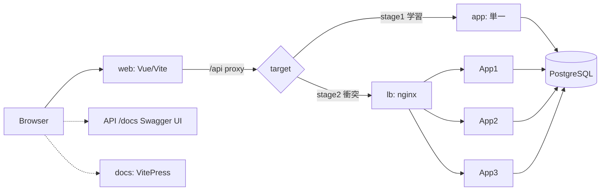

# 教材UX強化フェーズ — 設計（フロントエンド / チュートリアル / OpenAPI）

> 作成日: 2026-06-28
> 位置づけ: バックエンド実装完了後の **第2フェーズ＝教材としての精度・UX を高める**ための設計。
> 上位ドキュメント `2026-06-28-user-id-issuance-teaching-design.md`（目的の言語化）と、完了済みの実装（`app/` 一式・衝突デモ）を土台に、学習者が**触って・見て・読んで**理解できる教材パッケージを完成させる。

---

## 1. 目的とスコープ

完成済みのバックエンド（ユーザーID発行API・2ステージ・並列衝突デモ）に対し、**学習体験（UX）**を付け足す。具体的には次の4本柱:

1. **解説ドキュメント**（VitePress チュートリアル）— 2段階を、さらに細かいステップに分けた導入。自習でも読め、ライブ説明でも投影できる唯一の正典。
2. **API の叩き方をわかりやすく** — Swagger UI（OpenAPI ビューア）の「Try it out」を主役に、curl を補助として併記（コピペ実行可）。
3. **可視化フロントエンド** — ID発行の様子・発行件数・かぶり（衝突）件数・要件未達IDを、ブラウザでビジュアルに表示。
4. **Webの基本構成の解説** — ブラウザ→フロント→API→（LB）→DB の構成を図で。**ステージ1ではLBが現れず、ステージ2でLBが登場**する対比。→ 独立したスライドは作らず、VitePress 内の Mermaid 図つきページで表現する。

### 非目標（YAGNI）
- 認証・本番ビルド最適化・多言語化・独立スライドデッキ（Marp/Slidev）はやらない。
- worker-id 機構は現行の **明示 `WORKER_ID` ＋ 3サービス**を維持。設計書 §5.3 の `--scale`/hostname 序数案には寄せない（単純で確実、教材図とも一致）。
- DBによる一意性保証は引き続き採らない（既存方針）。

---

## 2. 技術選定（確定）

| 領域 | 採用 | 理由 |
|---|---|---|
| 可視化フロント | **Vite + Vue 3 + TypeScript**、Docker コンテナ | リッチなリアルタイム表示。VitePress と同じ Vue 系で統一しツールチェーンを一本化 |
| チュートリアル | **VitePress**（`docs/tutorial/`） | 検索・ナビ・見栄え。日本語フォント明示で CJK 安全。自習＋ライブ投影を1つで両立 |
| 図 | **Mermaid**（VitePress 内） | テキストで差分管理、ページフォント（Noto Sans JP）でCJK安全。構成図に最適 |
| API ドキュメント/実行器 | **FastAPI 自動生成 OpenAPI ＋ Swagger UI(`/docs`)** | 実装＝単一の出典（zod-openapi 相当をネイティブ提供）。新規ライブラリ不要 |
| スライド | 作らない | VitePress に吸収 |

- 本フェーズは前フェーズの「新規ランタイム依存を増やさない」制約の**対象外**。教材UXのため **Node/Vue/VitePress を新規導入**する（ユーザー承認済み）。
- Python 側ゲート（`ruff` / `mypy` / `pytest`）は引き続き緑を維持。フロント側にも軽量な品質ゲート（型チェック・lint）を用意する。
- 「全コマンドはコンテナ内」方針を踏襲（Node コマンドもコンテナ内で実行）。

---

## 3. バックエンド補強

### 3.1 一覧エンドポイント `GET /users`
- 現状 `/users` は `POST` と `GET /{id}` のみ。`crud.list_users` は実装済みだが未使用（オーフン）。
- **`GET /users`（`limit`/`offset`、`list[UserRead]` を返す）を追加**し、フロントが発行済みIDを取得して可視化・検証できるようにする。TDD。

### 3.2 OpenAPI を教材品質に磨く
- **409（衝突）レスポンスを宣言**: `POST /users` に `responses={409: {...}}` を付け、Swagger UI 上で「衝突時は 409」が明示されるようにする。
- **リクエスト/レスポンス例**を `UserCreate`/`UserRead` に付与（`model_config`/`Field(examples=...)`）。
- **エンドポイントの `summary`/`description`・`tags`** を整え、Swagger UI が読み物として成立するようにする。
- FastAPI アプリの `title`/`description`/`version` を教材向けに設定。
- これらは自動生成 OpenAPI を**実装から**リッチにするだけで、スキーマを手書きしない（DRY）。

### 3.3 「かぶり」の正しい意味（教材上の明文化）
- ユーザーテーブルの PK が一意性を機械的に担保するため、**重複行はDBに残らない**。衝突は発行時の **409 として現れる**（PK は衝突検出器）。
- したがってフロント／チュートリアルは「かぶり＝バッチ発行中の 409 件数」で表現する（`scripts/collision_demo.py` と同じ観測モデル）。

---

## 4. 可視化フロントエンド（`web/` サービス）

### 4.1 役割と画面
ブラウザから API を叩き、結果をリアルタイムに可視化する単一ページアプリ。表示要素:
- **発行操作**: 単発発行ボタン＋バッチ発行（総数 `TOTAL`・並列度 `CONCURRENCY` を指定）。
- **集計パネル**: 発行成功(201)・衝突(409)・重複率・スループットをリアルタイム更新。
- **ID妥当性の可視化**: 各IDに対し「10文字 / base62 のみ / 直前より大きい（ソート整合）」を判定し、**要件未達IDを色分け＋件数集計**。検証は**フロント側 TypeScript**で行う（追加APIは一覧のみで足りる）。
- **発行タイムライン/一覧**: 直近の発行IDと判定結果のリスト。

### 4.2 通信とターゲット切替
- 同一オリジンの **`/api` をプロキシ**で backend へ転送（CORS 回避）。
- 転送先 upstream は環境変数で可変:
  - 既定 = 単一サーバ（`app:8000` 等）→ ステージ1の学習（形式・ソート・単一プロセス一意性）。
  - 衝突デモ時 = LB（`lb:8080`）→ ステージ2の衝突観測→修正確認。
- これは `collision_demo.py` の `TARGET_URL` と同じ思想。compose のスタック選択でターゲットが決まる。

### 4.3 コンテナ化と品質
- `web/` に Vue+Vite アプリと `Dockerfile`。開発は Vite dev サーバ（`--host`、ホットリロード）をコンテナで起動。
- フロント品質ゲート: `vue-tsc`（型）/ ESLint（lint）を**コンテナ内**で実行できるようにする。
- ユニットテストは UX 部品としては最小限（検証ロジック＝base62/長さ/順序判定の純関数）に対して付ける。

---

## 5. チュートリアル（VitePress, `docs/tutorial/`）

### 5.1 構成（章立て）
自習で読め、ライブでも投影できる粒度に分割:
1. **イントロ / Webの基本構成** — ブラウザ→フロント→API→DB、LB の役割。Mermaid 構成図（**ステージ1=LBなし / ステージ2=LB登場**の対比）。← 旧「スライド」の中身。
2. **環境を立ち上げる** — コンテナ起動、各URL（API `/docs`・フロント・チュートリアル）。コピペ可能な手順。
3. **APIに触れる** — Swagger UI(`/docs`) の「Try it out」で `POST /users`・`GET /users` を実行。**同じ操作の curl** を併記（コピペ可）。
4. **ステージ1：ID発行ロジックを書く** — `ProblemIssuer.issue` 穴埋め。要件、フロント／`pytest` での確認。
5. **衝突を観測する** — 並列スタック起動、フロント（とスクリプト）で 409 を観測。なぜ起きるか（鳩の巣・定量分析、設計書第5章）。
6. **ステージ2：worker-id で直す** — 修正、再観測で衝突ゼロ。解答例 API との対比。
7. **付録** — IDビット構造、設計判断、トラブルシュート。

### 5.2 単一の出典（DRY）
- チュートリアルは、リポジトリ内の**実コード・実 curl・実コマンド**を出典として参照し、記述のドリフトを防ぐ。
- curl は VitePress コードブロック（コピーボタン付き）で各所に埋め込む。

### 5.3 配信
- VitePress を**コンテナ内**でビルド／プレビューできるようにする（dev サーバ or ビルド済み静的配信）。README は概要＋チュートリアルへの誘導に絞る。

---

## 6. 実行構成 / リポジトリ配置

**新規**
- `web/` — Vue+Vite アプリ（`Dockerfile`、`src/`、`vite.config.ts`、型/ lint 設定）。
- `docs/tutorial/` — VitePress サイト（`.vitepress/config.*`、章立て Markdown、Mermaid 図）。
- フロント／docs 用の compose サービス（`web`、必要なら `docs` プレビュー）。

**変更**
- `app/api/routes_user.py` — `GET /users` 追加、`responses`/`summary`/`tags` 付与。
- `app/schemas/user.py` — `examples` 付与。
- `app/main.py` — FastAPI `title`/`description`/`version`。
- `compose.yaml` — `web`（と `docs`）サービス、`/api` プロキシ設定。
- `README.md` — チュートリアルへの誘導に整理。

### サービス関係（概念）

---

## 7. テスト・品質方針
- **バックエンド**: `GET /users`・OpenAPI 例・409 宣言を TDD。既存 23 テスト＋追加を緑に保つ。`ruff`/`mypy` 緑維持。
- **フロント**: 検証ロジック（base62/長さ/順序）の純関数にユニットテスト。`vue-tsc`/ESLint をゲート化。
- **チュートリアル**: 記載コマンドが実環境で通ることを実機確認（各章の手順を一度なぞる）。
- 各タスクは「テスト先行→失敗確認→最小実装→通過確認→コミット」を踏襲。

---

## 8. CLAUDE.md 4原則との対応
- **KISS**: 検証はフロント側純関数、API追加は一覧のみ。OpenAPI は自動生成を磨くだけ。
- **YAGNI**: スライド／認証／codegen（既定）／本番最適化はやらない。codegen は任意拡張として記載のみ。
- **DRY＋直交性**: OpenAPI は実装が単一出典。チュートリアルは実コード/実コマンドを参照。媒体ごとに最適化された文章は「知識の重複」ではない。
- **対称性**: ステージ1/2 を「LBの有無」という実際の差異として図・章立てで対称に描く。

---

## 9. 未確定（実装計画で詰める）
- `web` の本番ビルド配信（nginx 静的）まで作るか、dev サーバのみか（既定は dev サーバで KISS、必要なら後続）。
- VitePress 配信をコンテナサービス化するか、ビルド成果物のみとするか。
- フロントの状態管理の粒度（素の composition API で足りる見込み）。
- OpenAPI からの型 codegen を採用するか（既定: 不採用＝手書き fetch。採用時は openapi-typescript を候補）。
