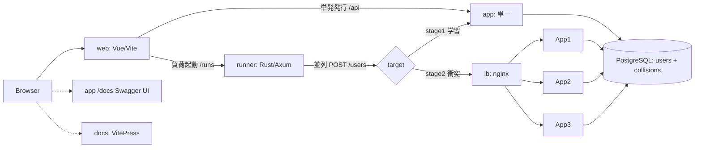

# 教材UX強化フェーズ — 設計（フロントエンド / チュートリアル / OpenAPI / 負荷ランナー）

> 作成日: 2026-06-28
> 位置づけ: バックエンド実装完了後の **第2フェーズ＝教材としての精度・UX を高める**ための設計。
> 上位ドキュメント `2026-06-28-user-id-issuance-teaching-design.md`（目的の言語化）と、完了済みの実装（`app/` 一式・衝突デモ）を土台に、学習者が**触って・見て・読んで**理解できる教材パッケージを完成させる。

---

## 1. 目的とスコープ

完成済みのバックエンド（ユーザーID発行API・2ステージ・並列衝突デモ）に対し、**学習体験（UX）**を付け足す。柱:

1. **解説ドキュメント**（VitePress チュートリアル）— 2段階を、さらに細かいステップに分けた導入。自習でも読め、ライブ説明でも投影できる唯一の正典。
2. **API の叩き方をわかりやすく** — Swagger UI（OpenAPI ビューア）の「Try it out」を主役に、curl を補助として併記（コピペ実行可）。
3. **可視化フロントエンド** — ID発行の様子・発行件数・かぶり（衝突=409）件数・要件未達IDを、ブラウザでビジュアルに表示。
4. **負荷ランナー＋衝突台帳** — 「N件生成するまで連続発行し、何回 409 が起きたか」を**並列度を変えて測れる**機能。並列度=1 が最初の段階（衝突ゼロ）、100/1000 が広範の段階（衝突発生）という教材アークを実機で再現。
5. **Webの基本構成の解説** — ブラウザ→フロント→API→（LB）→DB の構成を図で。**ステージ1ではLBが現れず、ステージ2でLBが登場**する対比。独立スライドは作らず、VitePress 内の Mermaid 図つきページで表現。

### 非目標（YAGNI）
- 認証・本番ビルド最適化・多言語化・独立スライドデッキ（Marp/Slidev）はやらない。
- worker-id 機構は現行の **明示 `WORKER_ID` ＋ 3サービス**を維持。設計書 §5.3 の `--scale`/hostname 序数案には寄せない。
- DBによる一意性保証は引き続き採らない（既存方針）。`collisions` テーブルは**観測専用**で、一意性保証には関与しない。

---

## 2. 技術選定（確定）

| コンポーネント | 採用 | 役割 / 理由 |
|---|---|---|
| **app** | Python / FastAPI（既存） | ID発行ドメインAPIに純化。一覧・OpenAPI 強化・衝突記録のみ追加 |
| **runner** | **Rust + Axum + tokio**（新規 `runner/`） | DB非依存の純HTTP負荷生成器。高並列(1000)を低CPU/メモリで。API サーバーと言語・ディレクトリ・コンテナを分離し純度を保つ |
| **web** | **Vite + Vue 3 + TypeScript**（新規 `web/`） | リアルタイム可視化。VitePress と同じ Vue 系で統一 |
| **docs** | **VitePress**（新規 `docs/tutorial/`） | 自習＋ライブ投影を両立。CJK安全。Mermaid 図 |
| API ドキュメント/実行器 | **FastAPI 自動生成 OpenAPI ＋ Swagger UI(`/docs`)** | 実装＝単一の出典（zod-openapi 相当をネイティブ提供）。新規ライブラリ不要 |
| スライド | 作らない | VitePress に吸収 |

- 本フェーズは前フェーズの「新規ランタイム依存を増やさない」制約の**対象外**。教材UXのため Node/Vue/VitePress・Rust/Axum を新規導入する（ユーザー承認済み）。
- 各言語の品質ゲートを緑に保つ:
  - Python: `ruff` / `ruff format` / `mypy` / `pytest`。
  - Rust: `cargo fmt --check` / `cargo clippy -D warnings` / `cargo test`。
  - Front: `vue-tsc`（型）/ ESLint（lint）/ 検証純関数の unit test。
- 「全コマンドはコンテナ内」方針を踏襲（cargo・node コマンドもコンテナ内）。

---

## 3. バックエンド補強（app）

### 3.1 一覧エンドポイント `GET /users`
- 現状 `/users` は `POST` と `GET /{id}` のみ。`crud.list_users` は実装済みだが未使用（オーフン）。
- **`GET /users`（`limit`/`offset`、`list[UserRead]`）を追加**し、フロントが発行済みIDを取得して可視化・検証できるようにする。TDD。

### 3.2 衝突台帳 `collisions` テーブル
- **Alembic migration `0002_create_collisions`** で新設。列（案）: `id`(PK, serial)、`attempted_id`(str10)、`name`、`occurred_at`(ts)、`worker_id`(int, nullable)。
- `POST /users` が 409（IntegrityError）を捕捉した際に **collision 行を記録**する。`users` の PK は「衝突の検出器」、`collisions` は「衝突の台帳」。
  - ホットパス（発行成功）は `users` への1 insert のみ。**collision の例外パスだけ**が台帳へ追記 → 観測専用で一意性保証には関与しない。
  - レプリカ横断で**単一の集計**が得られる（各 app が共有DBの同じ台帳へ追記）。
- **`GET /collisions`**（件数・直近一覧）と、必要なら `DELETE /collisions`（デモ前リセット用）を提供。

### 3.3 OpenAPI を教材品質に磨く
- **409 を宣言**: `POST /users` に `responses={409: {...}}`。Swagger UI 上で「衝突時は 409」が明示。
- **例**を `UserCreate`/`UserRead` に付与（`Field(examples=...)`）。`summary`/`description`/`tags` を整備。
- FastAPI の `title`/`description`/`version` を教材向けに設定。
- 自動生成 OpenAPI を**実装から**リッチにするだけ（スキーマ手書きしない＝DRY）。

---

## 4. 負荷ランナー（runner, Rust + Axum）

### 4.1 役割
- API サーバーとは独立した **HTTP 負荷生成サービス**。DBには触れない（純HTTPクライアント）。
- エンドポイント `POST /runs`（body: `{ n, concurrency, target }`）:
  - `target`（例 `http://lb:8080` or `http://app:8000`）へ `POST /users` を**並列度 `concurrency` で発行**。
  - **N件成功（201）するまで継続**し、その間の **409 件数・総試行数・所要時間・スループット**を集計。
  - 進捗は **SSE でストリーム**（UIがリアルタイム更新）。最終サマリも返す。
- 並列度: 1（単一＝衝突ゼロ）/ 100 / 1000（広範＝衝突発生）。tokio + reqwest（or hyper）で高並列を低資源に。

### 4.2 分離方針
- `runner/` に Rust crate（`Cargo.toml`, `src/`）。専用 `Dockerfile`、専用コンテナ。
- 既存 `scripts/collision_demo.py`（CLI）の観測モデル（201/409 集計）を Rust へ移植・常駐サービス化。CLI は残置（最小の代替手段）。

---

## 5. 可視化フロントエンド（web, Vue + Vite）

### 5.1 画面
- **単発発行**（低並列）: ブラウザから直接 `app` へ `POST /users`。ステージ1の「1件ずつ発行」体験。
- **負荷テスト**: `runner` の `POST /runs` を起動（N・並列度・target 指定）、SSE で **201/409/重複率/スループット**をリアルタイム表示。
- **ID妥当性の可視化**: `GET /users` の各IDに「10文字 / base62 のみ / 直前より大きい（ソート整合）」を判定し、**要件未達IDを色分け＋集計**。検証は**フロント側 TypeScript の純関数**（追加APIは一覧と台帳のみで足りる）。
- **衝突台帳ビュー**: `GET /collisions` の件数・一覧表示。runner の HTTP 集計と台帳が一致することを**相互チェック**として見せられる。

### 5.2 通信
- 同一オリジンの **`/api` をプロキシ**で各サービスへ（CORS 回避）。upstream は環境変数で可変（既定=単一 `app`、衝突デモ=`lb`）。runner へは別パスでプロキシ。
- コンテナ化: Vite dev サーバ（`--host`、ホットリロード）をコンテナで起動。

---

## 6. チュートリアル（VitePress, `docs/tutorial/`）

### 6.1 章立て
1. **イントロ / Webの基本構成** — ブラウザ→フロント→API→DB、LBの役割。Mermaid（**ステージ1=LBなし / ステージ2=LB登場**の対比）。← 旧「スライド」の中身。
2. **環境を立ち上げる** — コンテナ起動、各URL（API `/docs`・フロント・runner・チュートリアル）。コピペ手順。
3. **APIに触れる** — Swagger UI(`/docs`) の「Try it out」で `POST /users`・`GET /users`。**同じ操作の curl** を併記。
4. **ステージ1：ID発行ロジックを書く** — `ProblemIssuer.issue` 穴埋め。フロント単発発行／`pytest` で確認。
5. **衝突を観測する** — 並列スタック起動、**runner で並列1→100→1000**を実行、409 と台帳を観測。なぜ起きるか（鳩の巣・定量、設計書第5章）。
6. **ステージ2：worker-id で直す** — 修正、再観測で衝突ゼロ。解答例 API との対比。
7. **付録** — IDビット構造、設計判断、トラブルシュート。

### 6.2 単一の出典（DRY）・配信
- 実コード・実 curl・実コマンドを出典として参照（ドリフト防止）。curl はコピーボタン付きコードブロック。
- VitePress を**コンテナ内**でビルド／プレビュー。README は概要＋誘導に整理。

---

## 7. 実行構成 / リポジトリ配置

**新規ディレクトリ/サービス**
- `runner/` — Rust + Axum クレート、専用 `Dockerfile`。compose `runner` サービス。
- `web/` — Vue+Vite アプリ、専用 `Dockerfile`。compose `web` サービス。
- `docs/tutorial/` — VitePress サイト。compose `docs`（プレビュー）サービス（任意）。

**変更**
- `app/api/routes_user.py` — `GET /users`、`responses`/`summary`/`tags`、409時の台帳記録。
- `app/api/routes_collisions.py`（新規）— `GET /collisions`（＋任意の `DELETE`）。
- `app/models/collision.py`・`app/crud/collision.py`・`migrations/versions/0002_create_collisions.py`（新規）。
- `app/schemas/user.py` — `examples`。`app/main.py` — `title`/`description`/`version`、新ルーター結線。
- `compose.yaml` — `web`/`runner`/(`docs`) サービス、`/api` プロキシ。
- `README.md` — チュートリアルへ誘導。

### サービス関係（概念）

---

## 8. テスト・品質方針
- **app**: `GET /users`・`collisions` 記録/取得・OpenAPI(409/例) を TDD。既存 23 テスト＋追加を緑に。`ruff`/`mypy` 緑維持。
- **runner**: 集計ロジック（成功までの継続・409計数）を `cargo test`。`cargo fmt`/`clippy` 緑。
- **web**: 検証純関数（base62/長さ/順序）に unit test。`vue-tsc`/ESLint ゲート。
- **チュートリアル**: 各章のコマンドを実機で一度なぞって通ることを確認。
- 各タスクは「テスト先行→失敗確認→最小実装→通過確認→コミット」を踏襲。

---

## 9. CLAUDE.md 4原則との対応
- **KISS**: 検証はフロント純関数、app追加は一覧＋台帳のみ、OpenAPI は自動生成を磨くだけ。
- **YAGNI**: スライド／認証／codegen（既定不採用）／本番最適化はやらない。
- **DRY＋直交性**: OpenAPI は実装が単一出典。runner は app と関心を分離（負荷生成 vs ドメイン）。台帳と runner 集計は別観点（系の記録 vs 当該 runの観測）で、偽の重複ではない。
- **対称性**: ステージ1/2 を「LBの有無」「並列度 1 vs 多」という実差で対称に描く。

---

## 10. 未確定（実装計画で詰める）
- runner の `POST /runs` 進捗配信は SSE を既定とするが、初手は最終サマリ＋ポーリングで簡素化する余地あり。
- `web`/`docs` を本番ビルド静的配信までやるか、dev サーバ止まりか（既定は dev サーバ＝KISS）。
- `collisions` 記録列の最小セット（`attempted_id`/`occurred_at` のみで足りるか、`worker_id` も持つか）。
- OpenAPI からの型 codegen（既定: 不採用＝手書き fetch。採用時 openapi-typescript）。
