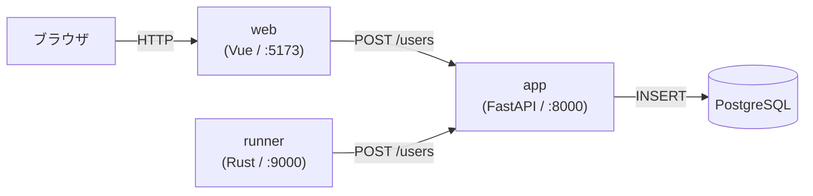
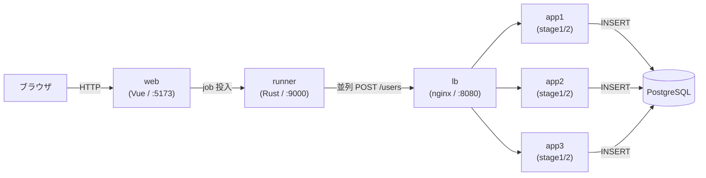

# イントロ — Web の基本構成

## このチュートリアルで学ぶこと

このチュートリアルでは、**分散システムにおける ID 衝突**を実際に手を動かして体験します。

学習の流れは3段階です。

1. **ステージ1（問題を実装する）**: `ProblemIssuer.issue()` に ID 発行ロジックを書く。
2. **衝突を観測する**: 並列度を上げると、worker-id なしの実装が衝突を起こすことを確認する。
3. **ステージ2（直す）**: プロセスごとに distinct な worker-id を付与し、衝突ゼロを確認する。

---

## システム構成

### ステージ1（LB なし）

ブラウザからフロントエンドを経由して、**単一の app** にリクエストが届きます。
プロセスが1つなので、worker-id の衝突は起きません。

### ステージ2（LB あり — 衝突を起こすデモ）

nginx ロードバランサを介して **3 つの app プロセス**（app1 / app2 / app3）に分散します。
全プロセスが同じ worker-id を使っていると、同一ミリ秒に複数プロセスが同一 ID を生成して衝突します。

---

## サービス一覧

| サービス | URL | 役割 |
|---|---|---|
| app | `http://localhost:8000` | ユーザー ID 発行 API（演習用、デフォルト `problem` 戦略）|
| solution | `http://localhost:8001` | 解答例 API（`stage2` 戦略、動作確認用）|
| web | `http://localhost:5173` | Vue フロントエンド |
| runner | `http://localhost:9000` | 負荷ランナー（Rust / Axum）|
| docs | `http://localhost:5174` | このチュートリアル |
| lb | `http://localhost:8080` | nginx LB（デモスタックのみ）|

---

## ID の設計思想（予告）

この教材の核心は「**なぜ単純な連番や UUID v4 ではなく、ビット構造を持つ ID を使うのか**」です。

- 連番（1, 2, 3, …）: 予測可能、分散生成できない。
- UUID v4（ランダム128bit）: 発行順にソートできない（ログ調査が困難）。
- この教材のID: **base62 × 10 文字**、先頭に時刻成分（ミリ秒）を持つので発行順ソート可能。かつ worker-id ビットで並列生成しても衝突しない（ステージ2）。

詳細は [付録](/07-appendix) を参照してください。
