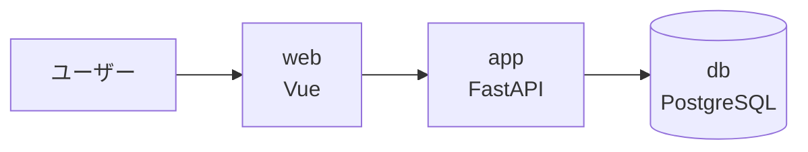

# サンプルの構成と起動

## サンプルの技術スタック

前章の3層は、このサンプルでは次のサービス・技術に対応します。

| 層 | サービス名 | 技術 | 役割 |
| --- | --- | --- | --- |
| **FE** | `web` | Vue | ブラウザUI（ID発行を試す・一覧を見る） |
| **BE** | `app` | FastAPI | ID発行API（このサンプルの主役） |
| **DB** | `db` | PostgreSQL | 発行したユーザーを保存 |



この3つに加えて、後の章で使う補助的なサービスも一緒に起動します（今は「あるんだな」程度でOK）。

- `solution` … 解答例の API（あとで自分の実装と見比べる）
- `runner` … 大量のID発行をまとめて行う負荷ランナー（[衝突を観測する章](/06-exercise-collision)で使う）
- `docs` … いま読んでいるこのチュートリアル

## 環境を立ち上げる

プロジェクトのルートで、次のコマンドを実行します。

```bash
docker compose up --build -d
```

- 初回はイメージのビルドのため **数分** かかります（2回目以降は速くなります）。
- `-d` は「バックグラウンドで起動」の意味です。

起動できたか確認します。

```bash
docker compose ps
```

各サービスが `running`（または `healthy`）になっていれば準備完了です。

## 各サービスのURL

ブラウザやコマンドから、次のURLでアクセスできます。

| 何を見る | URL |
| --- | --- |
| API ドキュメント（Swagger UI） | http://localhost:8000/docs |
| web（ブラウザUI） | http://localhost:5173 |
| 解答例 API の Swagger UI | http://localhost:8001/docs |
| 負荷ランナー（動作確認用） | http://localhost:9000/healthz |
| このチュートリアル | http://localhost:5174 |

## 動作確認

**API ドキュメント**（<http://localhost:8000/docs>）を開いてください。
`app`（FastAPI）が自動生成した API の一覧が表示されれば、バックエンドは正常です。

**web**（<http://localhost:5173>）を開いて、ページが表示されれば、フロントエンドも正常です。

**負荷ランナー** は、コマンドで確認できます。

```bash
curl http://localhost:9000/healthz
```

次のように返れば正常です。

```json
{"status":"ok"}
```

::: tip 演習用の `app` はまだ「未実装」です
このサンプルの `app`（<http://localhost:8000>）は、**あなたが実装する前の状態** で起動しています。<br>
そのため今 ID を発行しようとするとエラーになります。<br>
[ステージ1の章](/03-exercise-issue)で実装します。
すぐ動く完成版を見たいときは、解答例 `solution`（<http://localhost:8001/docs>）を使ってください。
:::

## 停止・クリーンアップ

学習を中断・終了するときは、次のコマンドで停止します。

```bash
docker compose down       # 停止（データは残る）
docker compose down -v    # データも消してリセット
```

次の章では、今回実装するAPIについて解説します。
