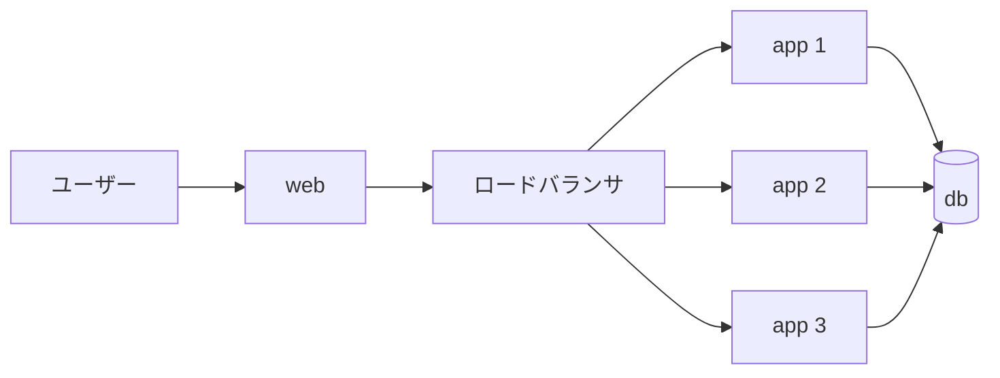

# スケールとロードバランサー

ステージ1のID発行は完成しました。1台のサーバーで動かすぶんには、要件をすべて満たしています。<br>
この章では、**アクセスが増えてきたら何が必要になるか** を考えます。

## 1台では捌ききれなくなる

サービスが人気になり、1秒間に大量の登録リクエストが来るようになったとします。<br>
1台のサーバーが処理できる量には限りがあるため、いずれ **捌ききれず、遅延やエラー** が起きます。

対策は大きく2つあります。

- **垂直スケール**：サーバー1台をより高性能なものにする
- **水平スケール**：同じサーバーを **何台も並べて** 分担する（このサンプルで扱うのはこちら）

## ロードバランサーで振り分ける

サーバーを複数台に増やしたら、来たリクエストを **どの台に渡すか** を決める担当が必要です。<br>
それが **ロードバランサー（LB）** です。LB が入口になり、リクエストを各サーバーへ振り分けます。



## 実は「1台で動く」前提だった

ここで、前の章までを振り返ってみましょう。<br>
あなたが実装した `issue()` は、**1台で動かすこと** を、前提にしていました。

同じ実装をそのまま **3台に並べて** 動かしたら、ID発行はまだ正しく動くでしょうか？<br>
―― これが次の章のテーマです。

## デモ環境を立ち上げる

3台構成を実際に動かしてみましょう。次のコマンドで、**LB ＋ app 3台 ＋ web ＋ 負荷ランナー** を起動します。<br>
あわせて、比較用に **1台だけの `app`** も同じ実装で起動しておきます（次章で「1台」と「3台」を見比べます）。

```bash
ID_STRATEGY=stage1 docker compose -f compose.yaml -f compose.demo.yaml up -d --build db app app1 app2 app3 lb runner web
```

- ここで使う `stage1` は、**サーバー を区別しない素朴な実装**です。これを **1台（`app`）** と、横に **並べた3台（`app1`〜`app3`＋`lb`）** の両方で起動しています。

次の章では、この3台構成に **大量のアクセス** すると何が起きるかを観測しましょう。
サーバー