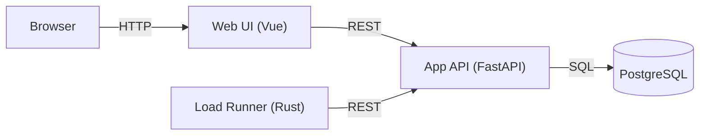

## このチュートリアルについて

このサイトは、分散システムにおけるユーザーID発行の仕組みを、  
**実際に手を動かして** 学ぶための教材です。

### 扱うテーマ

- **競合状態の観察**: 複数ワーカーが同じIDを払い出そうとすると何が起きるか
- **ステージ制の進化**: 問題あり実装 → 解決実装 への段階的な移行
- **API設計の実践**: FastAPI + PostgreSQL による現実的なバックエンド構成

### システム構成図

### 章構成

| 章 | タイトル |
|---|---|
| 01 | イントロ / Web構成 |
| 02 | 環境立ち上げ |
| 03 | APIに触れる |
| 04 | ステージ1 |
| 05 | 衝突を観測 |
| 06 | ステージ2 |
| 07 | 付録 |

左サイドバーから各章に進んでください。
